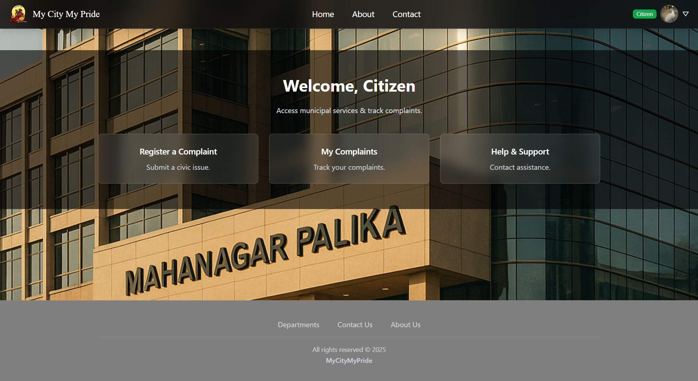
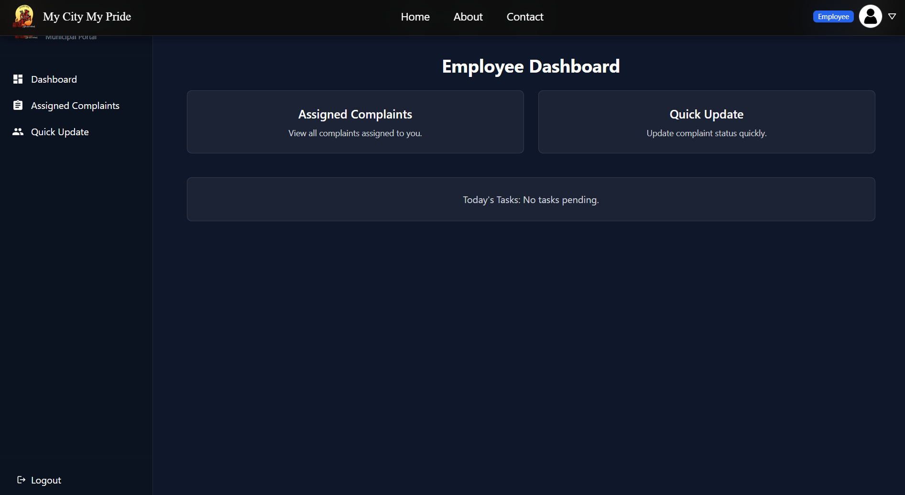
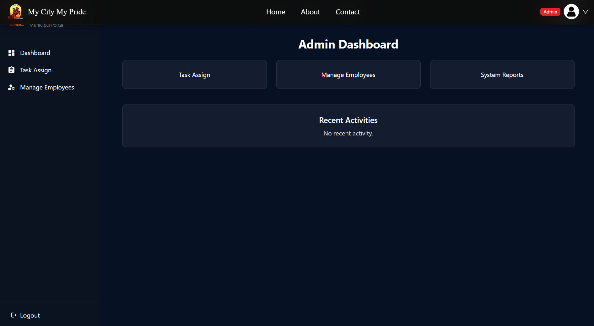

# 🏛️ SMART MUNICIPAL GOVERNANCE & PUBLIC ISSUE RESOLUTION SYSTEM
*A Full-Stack E-Governance Platform for Transparent Municipal Complaint Management*

## 📌 Overview
The **Smart Municipal Governance System** is a full-stack platform that simplifies civic complaint handling by connecting **Citizens**, **Municipal Employees**, and **Administrators** through a transparent workflow.

This system ensures:

- Faster complaint resolution
- Transparency across municipal operations
- Efficient department coordination
- Real-time complaint tracking

## 👥 Team Members
- **Dhiraj Chouhan**
- **Sandeep Khachariya**
- **Esmail Ali Sekh**
- **MNIT Jaipur – Department of CSE**
- **Submission Year:** 2025

## 🔗 GitHub Repository
**Repository Name:** `E-Governance-Municipal-system`  
https://github.com/Sandeep-he/E-Governance-Municipal-system

# 🚀 Features

## 👤 Citizen Features
- User registration & login
- Submit complaints
- Track complaint status
- View employee updates

## 🛠️ Employee Features
- Employee login
- View assigned complaints
- Update complaint status
- Add comments and progress details

## 🏢 Admin Features
- Manage employees
- Assign complaints
- View analytics & dashboards
- Oversee complete workflow

# 🧱 Tech Stack

### Frontend
- React.js
- Tailwind CSS
- Axios
- React Router DOM

### Backend
- Node.js
- Express.js
- JWT Authentication
- bcrypt password hashing

### Database
- MongoDB Atlas
- Mongoose ODM

# 📂 Project Structure
```
E-Governance-Municipal-system/
├── backend/
│   ├── controllers/
│   ├── models/
│   ├── routes/
│   ├── database.js
│   ├── main.js
│   └── .env
├── frontend/
│   ├── src/
│   ├── public/
│   ├── package.json
│   └── tailwind.config.js
└── README.md
```

# 🛠️ Installation Guide

## 1️⃣ Clone Repository
```bash
git clone https://github.com/Sandeep-he/E-Governance-Municipal-system
cd E-Governance-Municipal-system
```

## 2️⃣ Backend Setup
```bash
cd backend
npm install
```

Create a `.env` file:
```ini
PORT=3307
MONGO_URL=mongodb+srv://<username>:<password>@cluster0.mongodb.net/
JWT_SECRET=FA93JS82KDKW72HS6QPP98SJQWLAZ91
```

Start backend server:
```bash
npm start
```

Backend runs at:  
http://localhost:3307

## 3️⃣ Frontend Setup
```bash
cd ../frontend
npm install
npm start
```

Frontend runs at:  
http://localhost:3000

# 🖼️ Screenshots
- Citizen Home Page


- Employee Dashboard


- Admin ToDo


- Admin Dashboard


# 📘 Documentation Included
- ER Diagram
- DFD (Level 0–2)
- UML Diagrams
- SE Report
- Test Cases
- Risk & Feasibility Analysis
- Future Scope

# 🧪 Testing Overview

### Functional Tests
- 5 test cases with expected vs actual result comparison

### Negative Tests
- Invalid login
- Empty complaint submission

# 🔐 Environment Variables
| Variable | Description |
|---------|-------------|
| PORT | Backend server port |
| MONGO_URL | MongoDB connection string |
| JWT_SECRET | JWT encryption key |

# 🔮 Future Enhancements
- Mobile app development
- GIS-based city complaint mapping
- AI-powered complaint categorization
- Automated workload distribution
- Voice-enabled complaint registration

# 📚 References
- React: https://react.dev
- Express: https://expressjs.com
- MongoDB: https://www.mongodb.com/docs
- Node.js: https://nodejs.org/en/docs
- JWT: https://jwt.io
- Tailwind CSS: https://tailwindcss.com
- GitHub Repo: https://github.com/Sandeep-he/E-Governance-Municipal-system

# 📝 License
Open-source for academic & educational use only.

# 🙌 Acknowledgment
Developed as part of **Software Engineering Project 2025**,  
MNIT Jaipur — Department of CSE
